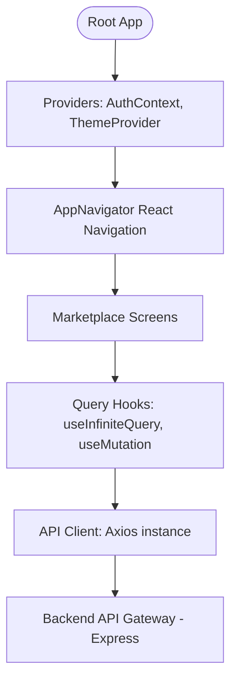

# Souk El Fellah Mobile 📱

A high-performance, premium, and beautifully designed React Native / Expo application built with TypeScript, tailored specifically for the Moroccan agricultural marketplace (**سوق الفلاح**). This app connects farmers, agricultural cooperatives, and buyers directly across all regions of Morocco.


---

## 🏗️ Architectural Overview

The mobile client is built on top of the **Ignite React Native Boilerplate** design patterns, utilizing a clean modular separation of concerns.



### Core Technologies

1. **Core Framework**: React Native + Expo (SDK 51) for fast compilation, easy native module access, and smooth performance.
2. **State Management & Caching**: TanStack React Query (v5) for handling asynchronous cache keys, query invalidations, pagination state, and caching strategies.
3. **Navigation**: React Navigation (Native Stack) for native-feeling transitions and gestures.
4. **Localization**: Fully translated using standard dictionary definitions with RTL layout mirroring support for Moroccan Arabic (Darija) and Standard Arabic.

---

## 🗺️ Application Screen Flow

The application divides its user experience into 12 primary screen containers:

1.  **Welcome Screen** (`WelcomeScreen`): Entry/onboarding interface.
2.  **Authentication Screens** (`LoginScreen`, `RegisterScreen`, `VerifyPhoneScreen`): Phone-based login and registration, complete with simulated/bypassable SMS OTP code entry.
3.  **Marketplace Home** (`HomeScreen`): Feed layout displaying search controls, a category selection carousel, and an infinite-scrolling listing feed.
4.  **Advanced Search & Filter** (`SearchScreen`): Text-based search with options to filter listings by category, pricing type (Fixed, Negotiable, Contact), location, and sorting.
5.  **Listing Detail** (`ListingDetailsScreen`): Clean, image-focused detail screen showing product info, condition, and quick call/WhatsApp shortcuts for contacting sellers.
6.  **Listing Creation Wizard** (`AddListingScreen`): Multi-step form for publishing products (crops, inputs) or agricultural equipment (tractors, implements).
7.  **Listing Editor Wizard** (`EditListingScreen`): Fully hydrated edit wizard that automatically bypasses step 1 (product/equipment type selection) to preserve schema integrity.
8.  **My Listings Portal** (`MyListingsScreen`): tab-divided view allowing users to track their Active, Sold, and Draft listings.
9.  **Favorites Hub** (`FavoritesScreen`): Quick-access repository for bookmarked listings.
10. **Notifications Inbox** (`NotificationsScreen`): Feeds system logs and targeted marketing campaigns.

---

## 📂 Project Directory Structure

```text
soukelfellah-mobile/
├── assets/                  # App icons, splash screens, and localized graphics
├── src/
│   ├── components/          # Reusable UI controls (Button, Card, Text, Header, Image)
│   ├── config/              # Constant parameters and global configuration values
│   ├── context/             # AuthContext (JWT tokens and User profiles lifecycle)
│   ├── localization/        # Translation dictionaries (ar, ary, en, fr)
│   ├── navigation/          # React Navigation routers and stack type declarations
│   ├── screens/             # UI Screen containers (Home, Details, Edit, Add, Search...)
│   ├── services/            # Backend communication modules
│   │   └── api/
│   │       ├── api.ts       # Axios instance config with ngrok skip validation
│   │       ├── hooks/       # React Query v5 custom hooks (useListings, useMutations...)
│   │       └── modules/     # API endpoints mapping (listings, categories, auth)
│   ├── theme/               # Core design system tokens (colors, typography, spacing)
│   └── utils/               # Formatting functions (date, currency converters)
├── App.js                   # Application initialization root
├── app.json                 # Expo configurations
└── tsconfig.json            # TypeScript engine rules
```

---

## 🇲🇦 Moroccan Darija & Multi-Language Translation

The application provides full support for Moroccan users through four translation dictionaries located in `src/localization/`:

- **Moroccan Darija (ary)**: Local Arabic dialect spoken by farmers.
- **Standard Arabic (ar)**: Formal language layout.
- **French (fr)**: Widely used for business and agriculture in Morocco.
- **English (en)**: Global standard.

System coordinates dynamically switch layouts to support Right-to-Left (RTL) reading patterns when Arabic/Darija is selected.

---

## 🛠️ Developer Setup & Launch Guide

### 1. Prerequisite Installations

- Ensure Node.js v20+ is installed on your computer.
- Install package manager `pnpm` globally:
  ```bash
  npm install -g pnpm
  ```

### 2. Environment Configuration

Create a `.env.local` or edit app configuration parameters to point to your backend API. In local development with ngrok, you can use:

```env
EXPO_PUBLIC_API_URL=https://your-ngrok-url.ngrok-free.app
```

### 3. Run Development Commands

- **Install Dependencies**:
  ```bash
  pnpm install
  ```
- **Start Metro Bundler**:
  ```bash
  pnpm start
  ```
- **Run on Android**:
  ```bash
  pnpm android
  ```
- **Run on iOS**:
  ```bash
  pnpm ios
  ```
- **Check TypeScript Compilation**:
  ```bash
  pnpm compile
  ```

---

## 🚀 Key Implementations & Enhancements

1.  **Skip Category Type Selection in Editing**: The listing editor detects if the operation is an edit. It skips Step 1 (the choice of whether the listing is a crop or equipment) and starts directly at Step 2 with hydrated states, preventing users from changing the core database schema listing type.
2.  **Yoga Layout Stability**: Solved blank-space gaps under the quantity inputs on Android by standardizing containers to use a static `flex: 1` flexbox layout instead of dynamically switching width tags.
3.  **Conditional Price Elements**: Price labels and currency descriptors are hidden if a listing doesn't specify a price (e.g. negotiable rentals), avoiding `undefined` displays.
4.  **Relative Listing Age Indicator**: Renders date descriptors like `Today` or `Yesterday` for listings created after 00:00, falling back to full date formatting for older items.
5.  **TanStack Query Cache Reset**: Replaced infinite query invalidations with `resetQueries` to clear page arrays and reset back to page 1 upon updates, saving network resources.

---

## 📜 Compliance & Google Play Store Submission URLs

To publish **Souk El Fellah** on the **Google Play Store**, the following public compliance URLs are required by Google Play Console policies:

### 1. Privacy Policy URL

- **Production URL**: `https://soukelfellah-backoffice.vercel.app/privacy`
- **Local Test URL**: `http://localhost:3000/privacy`
- **Google Play Console Placement**: Go to **Policy and Programs $\rightarrow$ App Content $\rightarrow$ Privacy Policy**.

### 2. Web Account Deletion Request URL

- **Production URL**: `https://soukelfellah-backoffice.vercel.app/delete-account`
- **Local Test URL**: `http://localhost:3000/delete-account`
- **Google Play Console Placement**: Go to **Policy and Programs $\rightarrow$ App Content $\rightarrow$ Data Safety $\rightarrow$ Account Deletion URL**.

### 3. Support Contacts

- **WhatsApp & Phone Support**: `+212 7 22 95 78 26`
